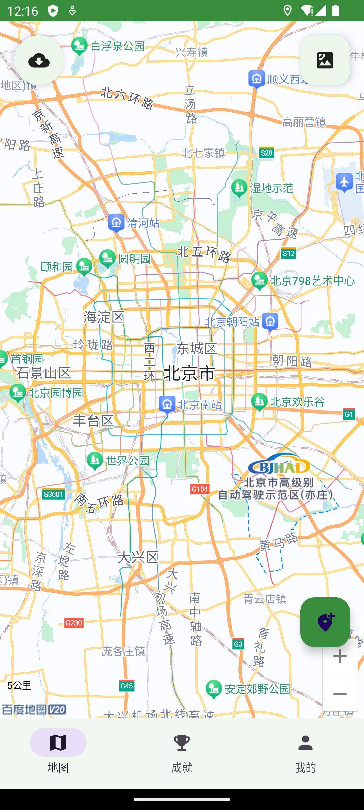
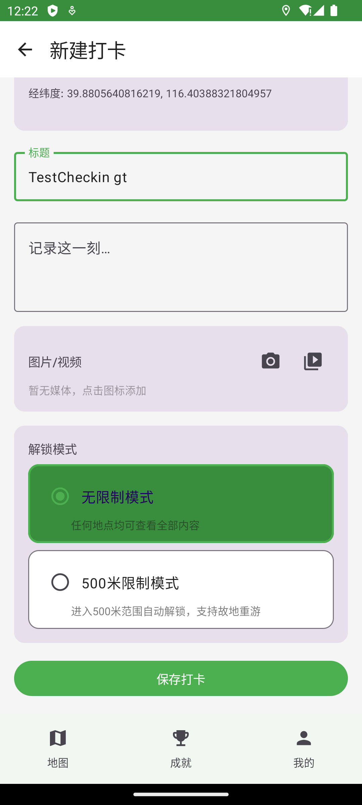
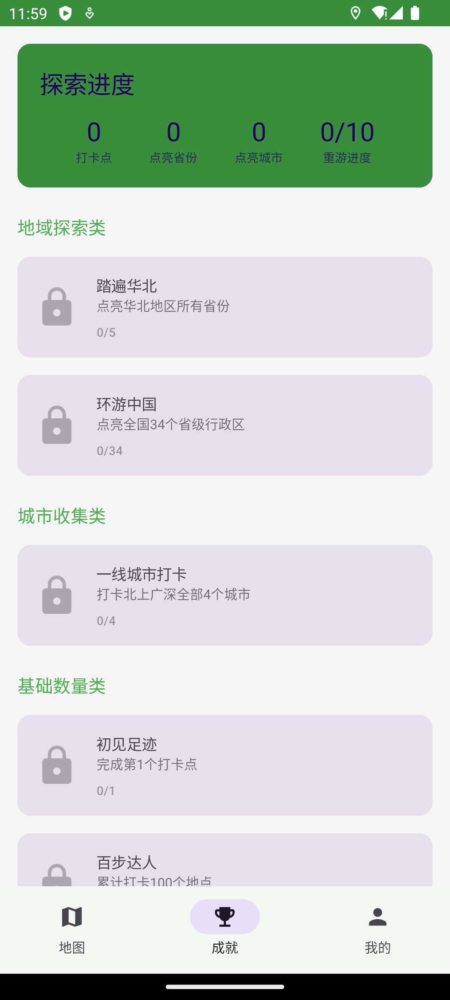
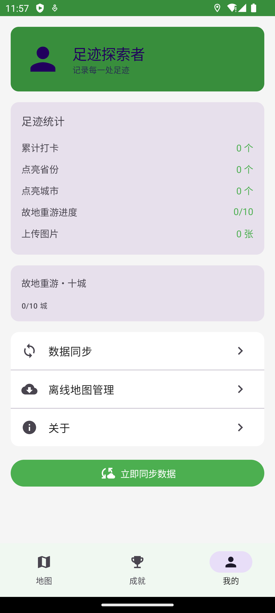

# 地图足迹打卡 · DaKa

在真实地理位置留下足迹的应用。打卡真实到访的地点，逐个点亮城市与省份，解锁成就；对"值得重游"的地点开启 500 米地理围栏限制，只有再次走进这片区域才能解锁看到当时的内容。

项目由两部分组成：

- **android/** — Kotlin + Jetpack Compose 客户端，基于百度地图/定位/导航 SDK，本地 Room 数据库离线可用
- **server/** — Java 17 + Spring Boot 3 服务端，提供账号、打卡点、媒体上传、成就与进度同步

| 地图主页 | 新建打卡 | 成就 | 我的 |
| --- | --- | --- | --- |
|  |  |  |  |

## 核心功能

### 1. 打卡与解锁模式

每个打卡点可选两种解锁模式：

| 模式 | 行为 |
| --- | --- |
| 无限制模式 | 任何地点均可查看全部内容（标题、正文、图片/视频） |
| 500 米限制模式 | 只有进入打卡点 500 米范围才解锁内容，离开围栏后重新锁定，支持"故地重游" |

打卡点支持标题、正文、图片/视频附件，自动带出经纬度、省/市/区与地址描述。

### 2. 故地重游机制

- 进入 500 米围栏 → 解锁该点内容，并触发围栏进入判定；离开围栏 → 内容重新锁定
- 同一打卡点重复进入有 60 秒防抖阈值，避免抖动误计
- **城市级进度**：每个城市只允许贡献一次"重游进度"，累计 10 个城市即达成成就
- **惩罚机制**：主动"解除位置限制"可将该点切换为无限制模式，但同时会**永久冻结该城市的故地重游资格**，该城市无法再贡献全局进度

### 3. 地域点亮

打卡后按 城市 → 省份 逐级点亮：城市有打卡记录即点亮该城市，省内任一城市点亮即点亮省份；删除最后一个打卡点时会反向熄灭。省份/城市点亮数量实时汇总到用户进度。

### 4. 成就系统

9 个成就，分属 6 个分类，全部在本地校验（`logic/AchievementChecker.kt`），进度实时写入：

| 分类 | 成就 | 达成条件 |
| --- | --- | --- |
| 基础数量类 | 初见足迹 | 完成第 1 个打卡点 |
| 基础数量类 | 百步达人 | 累计打卡 100 个地点 |
| 地域探索类 | 踏遍华北 | 点亮北京、天津、河北、山西、内蒙古 |
| 地域探索类 | 环游中国 | 点亮全国 34 个省级行政区 |
| 故地重游类 | 故地重游・一城 | 首个城市完成重游进度贡献 |
| 故地重游类 | 故地重游・十城 | 累计 10 个城市完成重游进度贡献 |
| 城市收集类 | 一线城市打卡 | 打卡北上广深全部 4 个城市 |
| 媒体收藏类 | 摄影达人 | 累计上传 100 张打卡图片 |
| 特殊探索类 | 边疆探索者 | 打卡新疆、西藏、内蒙古、黑龙江、云南 |

### 5. 离线优先与数据同步

- 所有数据先落本地 Room 数据库，打卡、成就校验、地域点亮、重游判定全部可离线完成
- 打卡点带同步状态（未同步 / 已同步 / 已修改），仅上传变更数据
- 支持"立即同步"手动触发，另有前台地理围栏服务保证后台持续监测
- 服务端提供批量同步接口 `/api/sync/batch`，与登录后的 JWT 身份绑定

### 6. 其他

- 离线地图下载与管理
- 打卡点一键"前往这里"调用百度导航
- 前台服务常驻通知，持续监测围栏（Android 10+ 使用 `FOREGROUND_SERVICE_LOCATION`）

## 技术栈

**客户端（android/）**

| 项 | 版本 / 说明 |
| --- | --- |
| 语言 | Kotlin，JVM Target 17 |
| UI | Jetpack Compose（BOM 2023.10.01）+ Material3 + Navigation Compose |
| 本地存储 | Room 2.6.1（KSP）、DataStore Preferences |
| 网络 | Retrofit 2.9 + OkHttp 4.12 + Gson、kotlinx-serialization |
| 异步 | Coroutines 1.7.3 + Flow |
| 其他 | Coil（图片）、WorkManager、Accompanist Permissions |
| 地图 | 百度地图 / 定位 / 导航 SDK（`app/libs` + `app/src/main/jniLibs`） |
| SDK 版本 | minSdk 26，targetSdk / compileSdk 36 |

**服务端（server/）**

| 项 | 版本 / 说明 |
| --- | --- |
| 语言 | Java 17 |
| 框架 | Spring Boot 3.2.0（Web / Data JPA / Validation） |
| 数据库 | MySQL 8，`ddl-auto=update` 自动建表 |
| 鉴权 | JJWT 0.12.3 + BCrypt（`spring-security-crypto`） |
| 构建 | Maven（`spring-boot-maven-plugin`）、Lombok |

## 目录结构

```
DaKa/
├── android/                                  Android 客户端
│   ├── app/src/main/java/com/daka/footprint/
│   │   ├── data/                             Room 实体 / DAO / Repository
│   │   ├── logic/                            成就校验、省份点亮、故地重游
│   │   ├── map/                              百度地图、定位、地理围栏、离线地图、导航
│   │   ├── network/                          Retrofit 接口、DTO、同步管理
│   │   ├── service/                          前台围栏服务、同步服务
│   │   ├── ui/                               Compose 页面（地图 / 打卡 / 成就 / 我的 / 离线地图）
│   │   ├── viewmodel/                        ViewModel
│   │   └── util/                             常量与权限工具
│   ├── app/libs/                             百度 SDK jar / aar
│   └── app/src/main/jniLibs/                 百度 SDK so
└── server/                                   Spring Boot 服务端
    └── src/main/java/com/daka/server/
        ├── controller/                       REST 接口
        ├── service/                          业务逻辑
        ├── entity/ repository/               JPA 实体与仓储
        ├── dto/                              请求 / 响应模型
        └── util/                             JWT 工具
```

## 快速开始

### 服务端

```bash
cd server
mvn clean package
java -jar target/daka-server-1.0.0.jar      # 或直接执行 start-server.bat
```

需要 JDK 17 与 MySQL 8。配置均可通过环境变量覆盖（见 `server/src/main/resources/application.yml`）：

| 环境变量 | 默认值 | 说明 |
| --- | --- | --- |
| `DB_URL` | `jdbc:mysql://localhost:3306/daka_footprint?...` | 数据库连接 |
| `DB_USERNAME` | `root` | 数据库账号 |
| `DB_PASSWORD` | `123456` | 数据库密码 |
| `JWT_SECRET` | 内置开发密钥 | JWT 签名密钥，**生产必须替换** |
| `UPLOAD_DIR` | `./uploads` | 媒体上传目录 |

### 客户端

1. 用 Android Studio 打开 `android/` 目录（JDK 17）
2. 在 `android/local.properties` 中配置 `sdk.dir`
3. 修改服务端地址：`app/src/main/java/com/daka/footprint/network/ApiClient.kt` 中的 `BASE_URL`（默认 `http://10.0.2.2:8080/`，仅供 Android 模拟器访问宿主机）
4. 在 `AndroidManifest.xml` 的 `com.baidu.lbsapi.API_KEY` 中填入自己的百度地图 AK
5. 构建：`./gradlew assembleDebug`

> release 构建需要签名文件 `android/daka-release.jks`（出于安全考虑未纳入版本库）。请自备密钥并在 `android/app/build.gradle.kts` 的 `signingConfigs` 中配置，或临时改用 debug 签名。

## 服务端接口

除登录外，所有接口均需在请求头携带 `Authorization: Bearer <token>`。

| 方法 | 路径 | 说明 |
| --- | --- | --- |
| POST | `/api/user/login` | 登录；用户名不存在时自动注册，返回 JWT |
| GET | `/api/checkin/list` | 当前用户打卡点列表 |
| POST | `/api/checkin/save` | 新增 / 更新打卡点（含媒体列表） |
| POST | `/api/checkin/delete/{id}` | 删除打卡点 |
| POST | `/api/media/upload` | 媒体上传，返回可访问 URL 与媒体类型 |
| POST | `/api/achievement/list` | 成就列表与进度 |
| POST | `/api/achievement/update` | 更新单项成就 |
| GET | `/api/progress` | 用户总进度（省份 / 城市 / 重游进度等） |
| POST | `/api/sync/batch` | 批量同步：打卡点 + 成就 + 进度一次性提交 |

媒体上传仅允许 `jpg/jpeg/png/gif/webp/mp4/mov/m4v`，单文件上限 50MB，落盘文件名使用 UUID，避免路径穿越与重名。

## 说明

- 百度地图 AK、数据库口令、JWT 默认密钥均为开发期配置，上线前必须替换
- 客户端与服务端的数据以"客户端本地为准 + 增量上报"的方式同步
